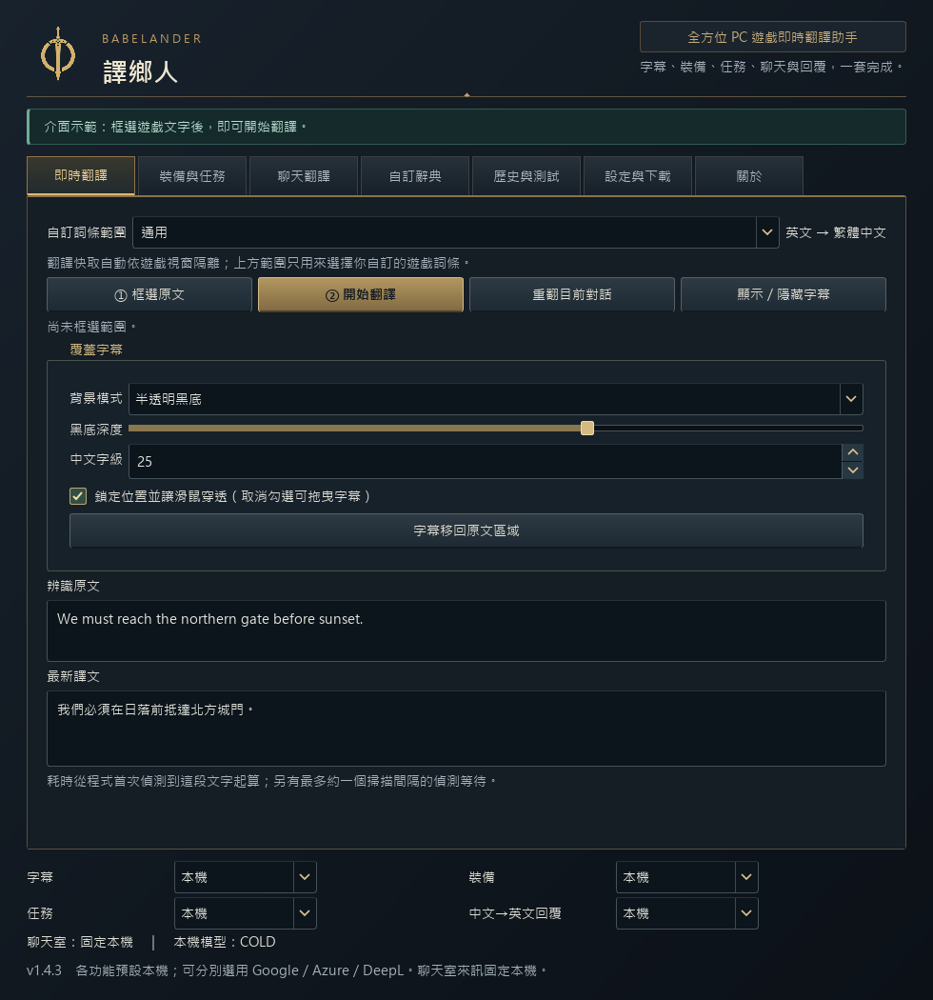
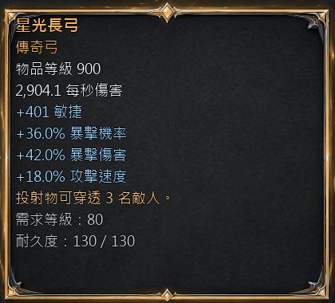
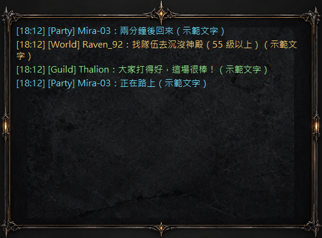
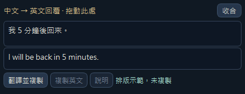

# Babelander 譯鄉人

**全方位 PC 遊戲即時翻譯助手**

**PC 遊戲 OCR 即時翻譯｜字幕、裝備、任務、聊天與中文 → 英文回覆**

Babelander 為 Windows PC 遊戲玩家提供英文 → 繁體中文翻譯與中文 → 英文回覆，透過 OCR 畫面辨識與遊戲浮層，協助玩家讀懂字幕、裝備、任務與聊天內容。

## 下載

**一般使用者推薦：下載最新 Windows 安裝版（檔名以 `-Setup.exe` 結尾）。**

### [下載 Babelander 最新版本 →](https://github.com/OverGreen996/Babelander-Releases/releases/latest)

進入發布頁後，展開 **Assets**，選擇 `Babelander-版本-Setup.exe`。免安裝使用者請選擇 `Babelander-版本-Windows-Lite.zip`。

[查看更新日誌](https://github.com/OverGreen996/Babelander-Releases/releases)

**[下載完整使用手冊（繁體中文 ZIP）](https://github.com/OverGreen996/Babelander-Releases/releases/download/v1.4.3/Babelander-User-Manual-zh-TW.zip)**

解壓後，以瀏覽器開啟 `Babelander_完整使用手冊.html`。內附 Google／Azure／DeepL 教學，請保留同一資料夾內的 `docs`。手冊目前獨立下載，尚未整合進安裝包。

## 軟體畫面

以下為 Babelander 實際介面截圖。字幕、裝備與對話使用示範文字，並非特定遊戲的實測紀錄。

### 主介面

集中設定遊戲 OCR 翻譯、浮層顯示與各功能使用的翻譯服務。

### 遊戲字幕翻譯浮層

範例原文：*We must reach the northern gate before sunset.* 浮層顯示繁體中文，可調整位置、字級與背景。

### 裝備卡翻譯

依裝備名稱顏色調整外框，保留屬性與數值，並配合框選範圍安排文字。

查看更多：聊天翻譯與中文 → 英文回覆

### 聊天翻譯

依頻道與玩家名稱顯示譯文；聊天花邊背景可自行開關。

### 中文 → 英文回覆小窗

輸入中文、取得英文，再自行貼回遊戲；小窗可拖曳與收合。

## 功能介紹

從單人 RPG 翻譯到 MMORPG 翻譯與組隊溝通，Babelander 將常見的 PC 遊戲翻譯需求整合在同一套介面中。

| 功能 | 說明 |
| --- | --- |
| 遊戲字幕翻譯 | 框選遊戲字幕區域，辨識英文並顯示繁體中文翻譯。 |
| 裝備翻譯與任務翻譯 | 翻譯裝備屬性、效果與任務內容；結合遊戲詞典與規則，保留資訊結構。 |
| 聊天翻譯 | 追蹤新增聊天訊息，支援長句換行與緊湊顯示；暫時隱藏面板時仍可繼續監測。 |
| 中文 → 英文回覆 | 獨立回覆小窗可拖曳、收合並保留本次草稿；翻譯後複製英文，由你自行貼回遊戲。 |
| 可調整浮層 | 外框配合框選範圍，文字自動縮放，內容過多時可捲動；可切換互動與滑鼠穿透。 |
| MMO 風格介面 | 深色介面、依裝備名稱顏色調整的外框，以及可開關的聊天花邊背景。 |
| 自訂辭典 | 支援自訂詞條及分領域遊戲參考詞彙，讓常用名稱與術語更一致。 |
| 用量管理 | 查看雲端翻譯用量、功能占比與卡片成本摘要，搭配應用程式字數上限控制使用量。 |

## 本機與雲端翻譯

字幕、裝備、任務與中文 → 英文回覆可分別選用本機、Google、Azure 或 DeepL，預設使用本機。**聊天室來訊僅在本機處理**；雲端功能需自行設定 API 並確認使用。

本機翻譯模型與額外執行元件需在程式內手動下載，完成後可離線翻譯。支援按需暖機、閒置卸載與效能模式設定；啟動時會檢查所需環境。

回覆小窗不會自動切換至遊戲、貼上或發送訊息。聊天與回覆草稿只保留在記憶體；選用雲端的功能會將待翻譯文字傳送至所選服務。

## 下載與安裝

1. 從 [官方 Release](https://github.com/OverGreen996/Babelander-Releases/releases/latest) 下載 `Setup.exe` 並依畫面安裝，不需要另外安裝 Python。免安裝版則完整解壓 `Windows-Lite.zip` 後執行，勿直接在 ZIP 內啟動。
2. 開啟「設定與下載」。使用本機翻譯前，手動下載翻譯模型與額外執行元件；使用雲端則設定所選服務的 API。
3. 框選遊戲中的文字區域，再啟動需要的翻譯功能。建議先以視窗或無邊框模式使用。

**升級不必先解除安裝**：關閉 Babelander 後執行新版 Setup，保留既有模型與設定。解除安裝會一併刪除模型、執行元件、設定、自訂辭典與快取，需要保留的資料請先備份。

一般使用者只需下載 **Setup 或 Windows-Lite 其中一種**。Third-Party Licenses、Qt／PySide／GEOS Source、THIRD_PARTY_SOURCE 與 SHA256SUMS 屬授權及驗證資料，不是額外安裝步驟；SHA256SUMS 可供自行核對下載檔案。GitHub 自動產生的 Source code 壓縮檔僅包含此公開庫文件。

OCR 翻譯效果取決於文字清晰度、字型與電腦效能；重要訊息與回覆請核對譯文。

## 授權與官方版本

**Copyright © 2026 OverGreen996. All Rights Reserved.**

Babelander 官方版本**免費提供個人使用**，自有內容採 **Proprietary 專有授權**。應用程式原始碼不公開。

未經作者 OverGreen996 書面授權，不得重新散布、修改後重新發布、重新打包、轉售、出租、再授權、改名發行、移除作者或授權資訊，或冒充官方版本。歡迎分享官方下載頁連結。

若透過非官方管道付費取得本軟體，請向販售者申請退費，並從官方頁面重新下載。

完整條款以 [LICENSE](LICENSE) 為準。

## 第三方授權

第三方元件仍依各自原始授權提供；Babelander 的專有授權不限制第三方授權賦予的權利，包括適用 LGPL 元件的修改、替換、重新連結及為除錯該等修改所需的逆向工程。

- [第三方元件與授權聲明](THIRD_PARTY_NOTICES.md)
- [第三方原始碼與函式庫替換說明](THIRD_PARTY_SOURCE.md)
- [遊戲詞典來源](reference/README.md) · [視覺素材來源](ASSET_PROVENANCE.md)
